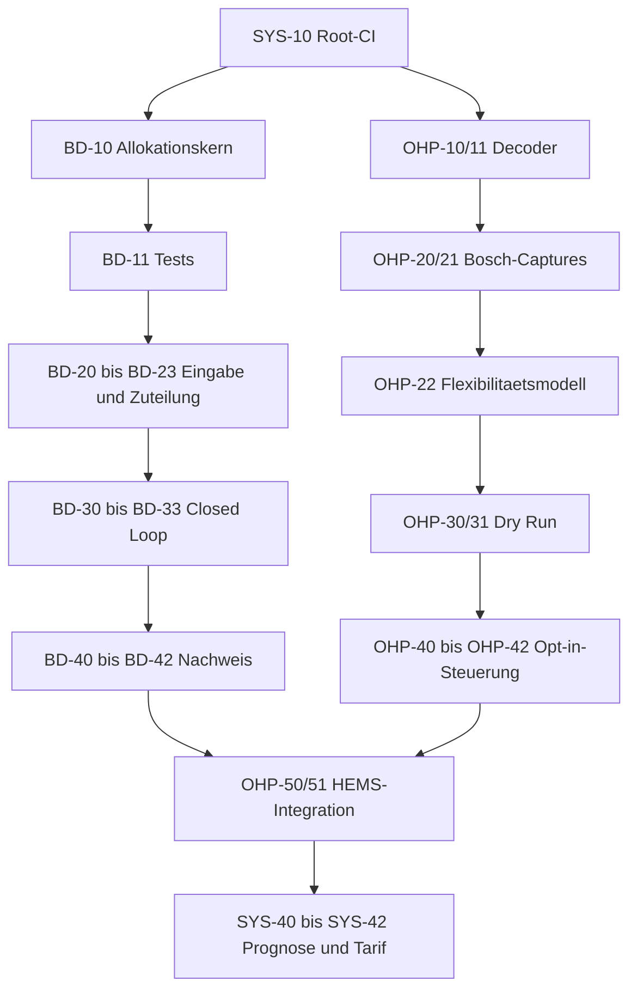

# Entwicklungs-TODO

Stand: 2026-07-13

Diese Datei ist die zentrale Status- und Reihenfolgenliste. Fachliche
Begruendung und Abnahmekriterien stehen in den verlinkten Konzeptdokumenten.

## Arbeitsweise

- `[ ]` offen, `[x]` abgeschlossen.
- Es wird immer die oberste nicht blockierte Aufgabe aus "Naechste Aufgaben"
  bearbeitet.
- Eine Aufgabe gilt erst als abgeschlossen, wenn ihre Tests und die Abnahme
  im zugehoerigen Konzept erfuellt sind.
- Blockaden werden direkt an der Aufgabe mit Grund und benoetigter
  Entscheidung dokumentiert.
- Bei Abschluss werden Datum und kurzer Verweis auf Commit, Testprotokoll oder
  Capture ergaenzt. Die ID bleibt dauerhaft bestehen.
- Neue Aufgaben erhalten eine ID ihres Themenbereichs und werden zuerst im
  zugehoerigen Konzept beschrieben.

## Naechste Aufgaben

1. **SYS-10** Root-CI als Sicherheitsnetz fuer die weiteren Umbauten.
2. **BD-10** Verteilalgorithmus verhaltensgleich in einen testbaren Kern
   extrahieren.
3. **BD-11** Bestehende und kritische Verteilfaelle als Host-Tests abdecken.
4. **OHP-20** Bosch-Capture-Matrix am realen Geraet abarbeiten.

## Systemarchitektur

Konzept: [Zielarchitektur und Entwicklungsplan](docs/system-architecture.md)

- [x] **SYS-00** Zielarchitektur und Entwicklungsplaene dokumentiert
  (2026-07-13).
- [x] **SYS-01** Zentrale TODO-Liste angelegt (2026-07-13).
- [ ] **SYS-10** Root-CI fuer ESPHome, Python, Host-Tests und Submodule
  einrichten; der Host-Testjob ist vorhanden, ESPHome und Python fehlen noch.
- [x] **SYS-11** Gemeinsames CMake/CTest-Host-Testziel fuer Regelkern und
  Fixtures bereitgestellt (2026-07-13).
- [ ] **SYS-12** Fake-Steuerbox/-Wallbox in reproduzierbare Szenariotests
  integrieren.
- [ ] **SYS-20** Systemzustaende normal/limited/degraded/failsafe definieren.
- [ ] **SYS-21** Strukturierte Betriebs- und Regeldiagnose bereitstellen.
- [ ] **SYS-22** Betreiberkonfiguration gegen Geraetefaehigkeiten validieren.
- [ ] **SYS-30** Netzwerk- und Zugangs-Bedrohungsmodell dokumentieren.
- [ ] **SYS-31** Webserver und MQTT absichern oder deaktivieren.
- [ ] **SYS-32** Update-, Backup- und Recovery-Verfahren testen.
- [ ] **SYS-40** Prognoseschnittstelle mit Unsicherheit definieren.
- [ ] **SYS-41** Eigenverbrauchsoptimierung im Dry Run bewerten.
- [ ] **SYS-42** Optional dynamische Tarife nachrangig integrieren.

## §14a-Budgetverteilung

Konzept: [§14a-Leistungsbudget-Verteilung](docs/power-distribution-concept.md)

- [x] **BD-00** Prioritaetsverteiler fuer EG1, EV und EG2 implementiert.
- [x] **BD-01** `min_limit_w` und Fremdgeraete-Guard implementiert.
- [ ] **BD-10** Testbaren Allokationskern aus YAML extrahieren.
- [ ] **BD-11** Allokationskern mit Host-Tests absichern.
- [ ] **BD-20** Alter und Qualitaet aller Budgeteingänge auswerten.
- [ ] **BD-21** Batterieentladung korrekt und konservativ saldieren.
- [ ] **BD-22** Technische Mindestleistung atomar behandeln.
- [ ] **BD-23** EV und Wallbox auf reale Leistungsstufen quantisieren.
- [ ] **BD-30** Aktive Limits spaetestens alle 60 Sekunden neu senden.
- [ ] **BD-31** Requested/acknowledged/measured je Verbraucher verfolgen.
- [ ] **BD-32** Closed-Loop-Compliance-Waechter implementieren.
- [ ] **BD-33** Degradierung, Failsafe und Reconnect deterministisch machen.
- [ ] **BD-40** Budget- und Compliance-Diagnose bereitstellen.
- [ ] **BD-41** Fake- und Hardware-Szenariotests durchfuehren.
- [ ] **BD-42** Reproduzierbares Compliance-Abnahmeprotokoll erstellen.

## Bosch OSSHPCF

Konzept: [Bosch-Waermepumpe: OSSHPCF / SEMP](docs/oss-hpcf-bosch.md)

- [x] **OHP-00** Use Case erkennen und SEMP-Server abonnieren; am realen
  Bosch-Geraet mit `err=0` verifiziert (2026-07-13).
- [x] **OHP-01** Standardvertrag und Bosch-Unbekannte dokumentiert
  (2026-07-13).
- [x] **OHP-10** `SmartEnergyManagementPsData` strukturiert und read-only
  dekodiert; Clean-Build verifiziert (2026-07-13).
- [x] **OHP-11** Decoder gegen leere, partielle, unbekannte und uebergrosse
  Payloads getestet; Ausgabe enthaelt keine Geraeteidentifikatoren
  (2026-07-13).
- [ ] **OHP-20** Bosch-Capture-Matrix am realen Geraet abarbeiten; Subscription
  allein liefert keinen initialen Zustand. Read-only Snapshot waehrend laufender
  Warmwasserbereitung zeigt Remote-Control-Faehigkeit, aber kein aktuelles
  Flexibilitaetsangebot (2026-07-14).
- [ ] **OHP-21** Bosch-Einheiten, Zeiten und State-Transitions dokumentieren.
- [ ] **OHP-22** Herstellerneutrales Flexibilitaetsmodell implementieren.
- [ ] **OHP-30** Constraint-bewussten Dry-run-Planer implementieren.
- [ ] **OHP-31** Planer gegen Zeit-, Reconnect- und LPC-Faelle testen.
- [ ] **OHP-40** Request-Transport und Transaktionszustand implementieren.
- [ ] **OHP-41** Standardmaessig deaktiviertes Betreiber-Opt-in ergaenzen.
- [ ] **OHP-42** Auswahl, Ablehnung, Timeout und Neustart simuliert testen.
- [ ] **OHP-50** OSSHPCF mit §14a-Budget und Datenqualitaet verbinden.
- [ ] **OHP-51** Kontrollierte Bosch-Hardwareabnahme dokumentieren.

## Abhaengigkeiten

