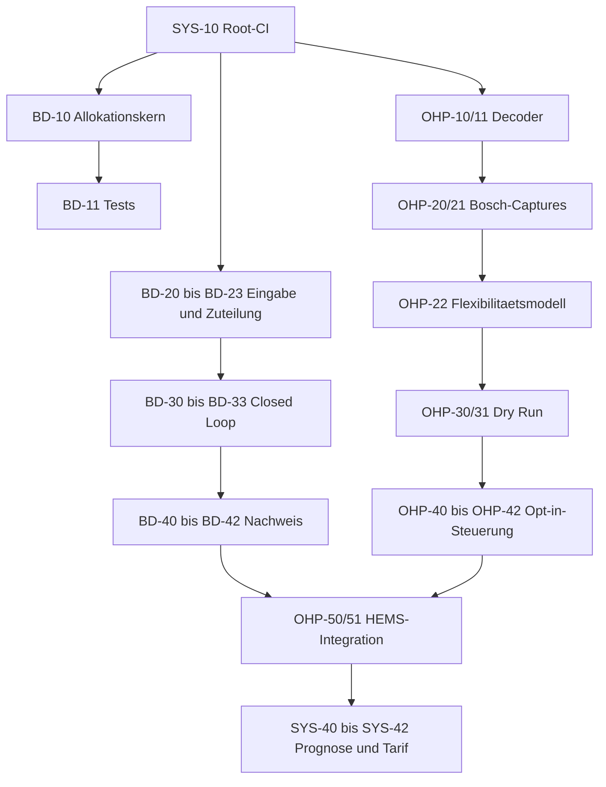

# Entwicklungs-TODO

Stand: 2026-07-13

Diese Datei ist die zentrale Status- und Reihenfolgenliste. Fachliche
Begruendung und Abnahmekriterien stehen in den verlinkten Konzeptdokumenten.

## Arbeitsweise

- `[ ]` offen, `[x]` abgeschlossen.
- Es wird immer die oberste nicht blockierte Aufgabe aus "Naechste Aufgaben"
  bearbeitet.
- Eine Aufgabe gilt erst als abgeschlossen, wenn ihre Tests und die Abnahme
  im zugehoerigen Konzept erfuellt sind.
- Blockaden werden direkt an der Aufgabe mit Grund und benoetigter
  Entscheidung dokumentiert.
- Bei Abschluss werden Datum und kurzer Verweis auf Commit, Testprotokoll oder
  Capture ergaenzt. Die ID bleibt dauerhaft bestehen.
- Neue Aufgaben erhalten eine ID ihres Themenbereichs und werden zuerst im
  zugehoerigen Konzept beschrieben.

## Naechste Aufgaben

1. **BD-23** EV und Wallbox auf reale Leistungsstufen quantisieren.
2. **BD-24** Xemex-CSMB-Hardwareabnahme abschliessen.
3. **OHP-20** Bosch-Capture-Matrix am realen Geraet abarbeiten.
4. **OHP-21** Bosch-Einheiten, Zeiten und State-Transitions dokumentieren.

## Systemarchitektur

Konzept: [Zielarchitektur und Entwicklungsplan](docs/system-architecture.md)

- [x] **SYS-00** Zielarchitektur und Entwicklungsplaene dokumentiert
  (2026-07-13).
- [x] **SYS-01** Zentrale TODO-Liste angelegt (2026-07-13).
- [x] **SYS-10** Root-CI fuer ESPHome, Python, Host-Tests und Submodule
  eingerichtet (2026-07-19). Der Workflow prueft Python-Syntax und
  Abhaengigkeiten, kompiliert die ESPHome-Firmware mit CI-Secrets und fuehrt die
  CMake/CTest-Host-Tests mit rekursivem Submodule-Checkout aus. actionlint,
  `compileall`, Host-Tests und vollstaendiger Firmware-Compile sind lokal gruen.
- [x] **SYS-11** Gemeinsames CMake/CTest-Host-Testziel fuer Regelkern und
  Fixtures bereitgestellt (2026-07-13).
- [ ] **SYS-12** Fake-Steuerbox/-Wallbox in reproduzierbare Szenariotests
  integrieren.
- [x] **SYS-13** Lokale OpenEEBUS-Toolchain vervollstaendigt und beide
  PR-Worktrees validiert (2026-07-19): CMake, Ninja, clang-format 18/22, MSVC
  Build Tools mit MFC/ATL, Windows SDK, vcpkg, Bonjour/mdnsresponder und GTest
  installiert. PR #43 und #44 bestehen den clang-format-18-Diffcheck, lokale
  MSVC-Builds sowie die vollstaendige Ubuntu-24.04-CMake/CTest-Suite. Beide
  Branches wurden auf `upstream/main` rebasiert und per `--force-with-lease`
  aktualisiert.
- [ ] **SYS-20** Systemzustaende normal/limited/degraded/failsafe definieren.
- [ ] **SYS-21** Strukturierte Betriebs- und Regeldiagnose bereitstellen.
- [ ] **SYS-22** Betreiberkonfiguration gegen Geraetefaehigkeiten validieren.
- [ ] **SYS-30** Netzwerk- und Zugangs-Bedrohungsmodell dokumentieren.
- [ ] **SYS-31** Webserver und MQTT absichern oder deaktivieren.
- [ ] **SYS-32** Update-, Backup- und Recovery-Verfahren testen.
- [ ] **SYS-40** Prognoseschnittstelle mit Unsicherheit definieren.
- [ ] **SYS-41** Eigenverbrauchsoptimierung im Dry Run bewerten.
- [ ] **SYS-42** Optional dynamische Tarife nachrangig integrieren.

## §14a-Budgetverteilung

Konzept: [§14a-Leistungsbudget-Verteilung](docs/power-distribution-concept.md)

- [x] **BD-00** Prioritaetsverteiler fuer EG1, EV und EG2 implementiert.
- [x] **BD-01** `min_limit_w` und Fremdgeraete-Guard implementiert.
- [ ] **BD-10** Testbaren Allokationskern aus YAML extrahieren; vorerst bewusst
  zurueckgestellt, die Verteilung bleibt in der ESPHome-Lambda.
- [ ] **BD-11** Allokationskern nach einer spaeteren Extraktion mit Host-Tests
  absichern.
- [x] **BD-20** Alter und Qualitaet der Budgeteingänge ausgewertet
  (2026-07-19): Solar- und Hausleistung verwenden echte Quellzeitstempel von
  HTTP/Modbus, maximal 10 s Alter sowie Finite-/Bereichspruefungen. Ungueltige
  oder alte Zusatzdaten erhoehen das VNB-Budget nie; ein ungueltiges Basislimit
  ergibt konservativ 0 W Gesamtbudget. Die Pruefung bleibt vorerst direkt in
  der ESPHome-Lambda.
- [x] **BD-21** Batterieentladung korrekt und konservativ saldiert
  (2026-07-19): Positive `Battery Power` bedeutet Entladung und erhoeht zusammen
  mit PV den Erzeugungsueberschuss; Laden sowie alte, fehlende, nicht-finite
  oder unplausible Batteriewerte zaehlen als 0 W Zusatzleistung. Beide
  Rohregister tragen echte 10-s-Quellzeitstempel und Wertebereichspruefungen.
- [x] **BD-22** Technische Mindestleistung atomar in der Lambda behandelt:
  Reicht das Budget nicht fuer den Sockel, erhaelt das Geraet 0 W.
- [ ] **BD-23** EV und Wallbox auf reale Leistungsstufen quantisieren.
- [ ] **BD-24** Stromverlaeufe der Wallbox auswerten und das CSMB-Regelkonzept
  bei Bedarf auf eine feine, schwingungsarme Steuerung ueberarbeiten. Als
  Referenz die bewaehrte Umsetzung in
  [thomase1234/esphome-fake-xemex-csmb](https://github.com/thomase1234/esphome-fake-xemex-csmb)
  heranziehen. Anschliessend erneut am realen Geraet messen, den Leistungssollwert
  mehrfach variieren und den Zyklus aus Auswertung, Anpassung und Test bei Bedarf
  wiederholen. Messbefund, Regelgesetz und Hardware-Abnahme stehen in
  [Xemex CSMB EV-Regelung](docs/xemex-control.md).
- [x] **BD-25** K40RF an der realen Waermepumpe mit §14a-Limits unter 4.200 W
  getestet (2026-07-20). 4.200 W wurden per LPC ACK bestaetigt; 4.000, 3.600,
  3.200, 2.800, 2.400 und 2.000 W blieben jeweils 15 s ohne ACK bei stabiler
  Verbindung. Damit bleibt 4.200 W die technische Mindestleistung; das Szenario
  `6.000 W Wallbox + 2.400 W Waermepumpe` ist mit K40RF nicht umsetzbar.
  Captures: `private/captures/k40rf-low-limits-20260720.csv` und
  `private/captures/k40rf-4200-ack-20260720.csv`.
- [ ] **BD-30** Aktive Limits spaetestens alle 60 Sekunden neu senden.
- [ ] **BD-31** Requested/acknowledged/measured je Verbraucher verfolgen.
- [ ] **BD-32** Closed-Loop-Compliance-Waechter implementieren.
- [ ] **BD-33** Degradierung, Failsafe und Reconnect deterministisch machen.
- [ ] **BD-40** Budget- und Compliance-Diagnose bereitstellen.
- [ ] **BD-41** Fake- und Hardware-Szenariotests durchfuehren.
- [ ] **BD-42** Reproduzierbares Compliance-Abnahmeprotokoll erstellen.

## Bosch OSSHPCF

Konzept: [Bosch-Waermepumpe: OSSHPCF / SEMP](docs/oss-hpcf-bosch.md)

- [x] **OHP-00** Use Case erkennen und SEMP-Server abonnieren; am realen
  Bosch-Geraet mit `err=0` verifiziert (2026-07-13).
- [x] **OHP-01** Standardvertrag und Bosch-Unbekannte dokumentiert
  (2026-07-13).
- [x] **OHP-10** `SmartEnergyManagementPsData` strukturiert und read-only
  dekodiert; Clean-Build verifiziert (2026-07-13).
- [x] **OHP-11** Decoder gegen leere, partielle, unbekannte und uebergrosse
  Payloads getestet; Ausgabe enthaelt keine Geraeteidentifikatoren
  (2026-07-13).
- [ ] **OHP-20** Bosch-Capture-Matrix am realen Geraet abarbeiten; Subscription
  allein liefert keinen initialen Zustand. Read-only Snapshot waehrend laufender
  Warmwasserbereitung zeigt Remote-Control-Faehigkeit, aber kein aktuelles
  Flexibilitaetsangebot (2026-07-14).
- [ ] **OHP-21** Bosch-Einheiten, Zeiten und State-Transitions dokumentieren.
- [ ] **OHP-22** Herstellerneutrales Flexibilitaetsmodell implementieren.
- [ ] **OHP-30** Constraint-bewussten Dry-run-Planer implementieren.
- [ ] **OHP-31** Planer gegen Zeit-, Reconnect- und LPC-Faelle testen.
- [ ] **OHP-40** Request-Transport und Transaktionszustand implementieren.
- [ ] **OHP-41** Standardmaessig deaktiviertes Betreiber-Opt-in ergaenzen.
- [ ] **OHP-42** Auswahl, Ablehnung, Timeout und Neustart simuliert testen.
- [ ] **OHP-50** OSSHPCF mit §14a-Budget und Datenqualitaet verbinden.
- [ ] **OHP-51** Kontrollierte Bosch-Hardwareabnahme dokumentieren.

## Abhaengigkeiten

